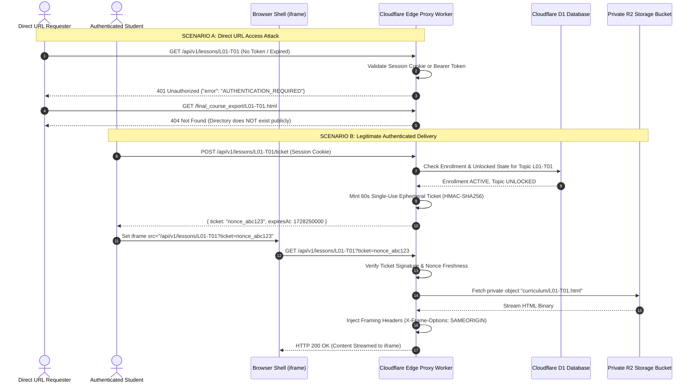

# Authentication, Access Control & Secure Content Gating Specification
## Zero-Trust Content Protection & Google Sign-In Architecture
**Document Reference:** `cloud_architecture_spec/02_AUTH_AND_SECURITY_SPEC.md`  
**Target:** Engineering Team & Autonomous Coding Agents  

---

## 1. Authentication Architecture (Google Sign-In)

### 1.1 Client-Side Google Identity Services (GSI) Integration
The Course Shell and Auth pages load Google Identity Services:
```html
<script src="https://accounts.google.com/gsi/client" async defer></script>
```

**Client Sign-In Initialization:**
```javascript
google.accounts.id.initialize({
  client_id: "105862609227988682159-xxxxxxxxxxxx.apps.googleusercontent.com",
  callback: handleGoogleCredentialResponse,
  auto_select: false,
  cancel_on_tap_outside: true,
  context: "signin"
});

// Render the official Google Sign-In button
google.accounts.id.renderButton(
  document.getElementById("google-signin-btn"),
  { theme: "outline", size: "large", type: "standard", shape: "pill", width: 280 }
);

async function handleGoogleCredentialResponse(response) {
  const idToken = response.credential; // Signed Google JWT
  
  // Exchange Google ID Token with TX-ADE Auth Service
  const res = await fetch("https://api.texasade.org/api/v1/auth/google", {
    method: "POST",
    headers: { "Content-Type": "application/json" },
    credentials: "include", // Permits HttpOnly cookie storage
    body: JSON.stringify({ id_token: idToken })
  });

  const data = await res.json();
  if (data.success) {
    if (data.user.enrollment_status === "ACTIVE") {
      window.location.href = "/course-shell.html";
    } else {
      window.location.href = "/checkout.html";
    }
  } else {
    showAuthError(data.error);
  }
}
```

---

### 1.2 Server-Side Token Verification & Session Minting (Edge Worker)
When the Edge Worker receives `POST /api/v1/auth/google`, it performs the following cryptographically secure validation:

```typescript
import { createRemoteJWKSet, jwtVerify } from 'jose';

// Google Public Certificate JWKS Endpoint
const GOOGLE_JWKS = createRemoteJWKSet(
  new URL('https://www.googleapis.com/oauth2/v3/certs')
);

export async function handleGoogleAuth(request: Request, env: Env): Promise<Response> {
  const { id_token } = await request.json();

  // 1. Cryptographically verify Google ID Token signature and claims
  const { payload } = await jwtVerify(id_token, GOOGLE_JWKS, {
    issuer: ['https://accounts.google.com', 'accounts.google.com'],
    audience: env.GOOGLE_CLIENT_ID,
  });

  const googleSub = payload.sub as string;
  const email = (payload.email as string).toLowerCase();
  const name = payload.name as string || '';
  const picture = payload.picture as string || '';
  const emailVerified = payload.email_verified as boolean;

  if (!emailVerified) {
    return new Response(JSON.stringify({ error: 'EMAIL_NOT_VERIFIED' }), { status: 400 });
  }

  // 2. Query or Upsert User in Cloudflare D1
  let user = await env.DB.prepare(
    `SELECT id, email, full_name, role, enrollment_status FROM users WHERE google_sub = ?`
  ).bind(googleSub).first();

  if (!user) {
    const userId = crypto.randomUUID();
    await env.DB.prepare(
      `INSERT INTO users (id, google_sub, email, full_name, profile_image, enrollment_status, created_at, updated_at)
       VALUES (?, ?, ?, ?, ?, 'UNPAID', datetime('now'), datetime('now'))`
    ).bind(userId, googleSub, email, name, picture).run();

    user = { id: userId, email, full_name: name, role: 'STUDENT', enrollment_status: 'UNPAID' };
  }

  // 3. Mint Internal TX-ADE Session JWT (HMAC-SHA256 with ENV SECRET)
  const sessionToken = await createSessionToken(user, env.JWT_SECRET, 86400 * 7); // 7-day session

  // 4. Return Session Cookie & User Profile
  const headers = new Headers();
  headers.append('Content-Type', 'application/json');
  headers.append('Set-Cookie', `tx_session=${sessionToken}; Path=/; HttpOnly; Secure; SameSite=Strict; Max-Age=604800`);

  return new Response(JSON.stringify({
    success: true,
    user: {
      id: user.id,
      email: user.email,
      name: user.full_name,
      enrollment_status: user.enrollment_status
    }
  }), { status: 200, headers });
}
```

---

## 2. Course Access & Locking Matrix

Access is enforced uniformly at the edge gateway.

| User State | Shell Interface (`course-shell.html`) | Lesson Endpoints (`/api/v1/lessons/*`) | Quiz Submissions (`/api/v1/quizzes/*`) | Certificate API (`/api/v1/cert/*`) |
|:---|:---|:---|:---|:---|
| **Anonymous (Public)** | Redirect to `/login.html` | **401 Unauthorized** | **401 Unauthorized** | **401 Unauthorized** |
| **Signed In (Unpaid)** | Shows Payment Required Modal | **403 Payment Required** | **403 Forbidden** | **403 Forbidden** |
| **Enrolled (Active)** | Full Course Shell Loaded | **200 OK (Unlocked Topics)**<br>**403 Locked (Future Topics)** | **200 OK (Eligible Module)** | **403 Incomplete Course** |
| **Completed Course** | Review Mode Enabled | **200 OK (All 75 Topics)** | **200 OK (Review History)** | **200 OK (Download PDF)** |

---

## 3. High-Security Gated Content Pulling: The Direct URL Prevention Architecture

### 3.1 The Problem
If course files were stored in public directories, an attacker or student could enter:
```
https://www.ourdomain.com/final_course_export/L01-T01.html
https://www.ourdomain.com/lesson/L01-T01
https://www.ourdomain.com/rebuilds/L09-T01.html
```
and bypass all timer requirements, payment gates, and licensing restrictions.

### 3.2 The Zero-Trust Content Protection Solution



---

### 3.3 Ephemeral Single-Use Ticket Implementation

#### Step 1: Parent Shell Obtains Ephemeral Ticket
```typescript
// Edge Worker: POST /api/v1/lessons/:topicId/ticket
export async function handleGenerateLessonTicket(request: Request, env: Env, user: AuthUser): Promise<Response> {
  const url = new URL(request.url);
  const topicId = url.pathname.split('/')[4]; // e.g., 'L01-T01'

  // 1. Verify user is actively enrolled
  if (user.enrollment_status !== 'ACTIVE') {
    return new Response(JSON.stringify({ error: 'ENROLLMENT_INACTIVE' }), { status: 403 });
  }

  // 2. Query topic lock state from Database
  const progress = await env.DB.prepare(
    `SELECT status FROM topic_progress WHERE user_id = ? AND topic_id = ?`
  ).bind(user.id, topicId).first();

  // If topic is not unlocked, reject with 403 Forbidden
  if (!progress || progress.status === 'LOCKED') {
    return new Response(JSON.stringify({
      error: 'TOPIC_LOCKED',
      message: `Topic ${topicId} is locked. You must complete prerequisite topics first.`
    }), { status: 403 });
  }

  // 3. Generate Ephemeral Nonce & Signature (TTL = 60 Seconds)
  const nonce = crypto.randomUUID();
  const expiresAt = Math.floor(Date.now() / 1000) + 60; // 60-second window
  const payload = `${user.id}:${topicId}:${nonce}:${expiresAt}`;
  const signature = await hmacSha256(env.TICKET_SECRET, payload);

  // Store nonce in Cloudflare KV with 60s TTL to ensure SINGLE-USE
  await env.TICKET_KV.put(`ticket:${nonce}`, user.id, { expirationTtl: 60 });

  return new Response(JSON.stringify({
    success: true,
    ticket: `${payload}.${signature}`
  }), { status: 200, headers: { 'Content-Type': 'application/json' } });
}
```

#### Step 2: Content Proxy Worker Streams Lesson from R2
```typescript
// Edge Worker: GET /api/v1/lessons/:topicId?ticket=...
export async function handleStreamLesson(request: Request, env: Env): Promise<Response> {
  const url = new URL(request.url);
  const topicId = url.pathname.split('/')[4];
  const ticketParam = url.searchParams.get('ticket');

  if (!ticketParam) {
    return new Response('401 Unauthorized: Missing access ticket', { status: 401 });
  }

  // 1. Parse and verify ticket signature
  const [dataPayload, signature] = ticketParam.split('.');
  const [userId, expectedTopicId, nonce, expiresAtStr] = dataPayload.split(':');
  const expiresAt = parseInt(expiresAtStr, 10);

  // Check Expiration
  if (Date.now() / 1000 > expiresAt) {
    return new Response('403 Forbidden: Ticket expired', { status: 403 });
  }

  // Check Topic Identity
  if (expectedTopicId !== topicId) {
    return new Response('403 Forbidden: Ticket topic mismatch', { status: 403 });
  }

  // Verify HMAC-SHA256 Signature
  const expectedSignature = await hmacSha256(env.TICKET_SECRET, dataPayload);
  if (signature !== expectedSignature) {
    return new Response('403 Forbidden: Cryptographic signature invalid', { status: 403 });
  }

  // 2. Enforce Single-Use via Cloudflare KV
  const storedNonce = await env.TICKET_KV.get(`ticket:${nonce}`);
  if (!storedNonce) {
    return new Response('403 Forbidden: Ticket has already been used or revoked', { status: 403 });
  }
  // Delete nonce immediately after consumption
  await env.TICKET_KV.delete(`ticket:${nonce}`);

  // 3. Fetch from Private R2 Bucket (Zero Public Egress)
  const r2Object = await env.CURRICULUM_R2.get(`topics/${topicId}.html`);
  if (!r2Object) {
    return new Response('404 Not Found: Curriculum content missing', { status: 404 });
  }

  // 4. Inject Strict Anti-Hijacking and Frame Protection Headers
  const headers = new Headers();
  r2Object.writeHttpMetadata(headers);
  headers.set('Content-Type', 'text/html; charset=utf-8');
  headers.set('X-Frame-Options', 'SAMEORIGIN');
  headers.set('Content-Security-Policy', "frame-ancestors 'self' https://app.texasade.org;");
  headers.set('Cache-Control', 'private, no-cache, no-store, must-revalidate');
  headers.set('X-Content-Type-Options', 'nosniff');

  return new Response(r2Object.body, { status: 200, headers });
}
```

---

## 4. Protected Asset Delivery (2.5D Dioramas & Interactive Graphics)

The 44 visual diorama assets (`/assets/2_5d/*.jpg`) must also be protected from bulk scraping.
- Worker route: `/api/v1/assets/2_5d/:fileName`
- Checked via the active student session cookie.
- If valid session exists, Worker fetches from `env.CURRICULUM_R2.get("assets/2_5d/" + fileName)` and returns with `Cache-Control: private, max-age=3600`.
- If no session exists, returns `403 Forbidden`.

---

## 5. Sequential Lesson Unlocking Invariant

The platform enforces strict linear progression:
$$\text{Topic } N \text{ Unlocked} \iff \left(\text{Topic } N-1 \text{ Status} = \text{"COMPLETED"}\right) \land \left(\text{Module Quiz Passed} = \text{true}\right)$$

### Unlocking Flow Logic
```typescript
export async function advanceStudentToNextTopic(userId: string, completedTopicId: string, env: Env) {
  // 1. Look up global index of completedTopicId
  const currentIndex = ALL_TOPIC_IDS.indexOf(completedTopicId);
  if (currentIndex === -1) throw new Error('Invalid topic ID');

  // 2. Mark completed topic in DB
  await env.DB.prepare(
    `UPDATE topic_progress 
     SET status = 'COMPLETED', completed_at = datetime('now'), updated_at = datetime('now')
     WHERE user_id = ? AND topic_id = ?`
  ).bind(userId, completedTopicId).run();

  // 3. Check if completed topic was the final topic of a module
  const isModuleBoundary = MODULE_END_TOPICS.includes(completedTopicId);
  if (isModuleBoundary) {
    // Require Module Quiz completion before unlocking next topic
    const moduleNumber = getModuleNumber(completedTopicId);
    await env.DB.prepare(
      `UPDATE module_progress
       SET status = 'QUIZ_PENDING', updated_at = datetime('now')
       WHERE user_id = ? AND module_id = ?`
    ).bind(userId, moduleNumber).run();
    return { nextAction: 'REQUIRE_MODULE_QUIZ', moduleId: moduleNumber };
  }

  // 4. Otherwise, unlock the immediate next topic
  if (currentIndex < ALL_TOPIC_IDS.length - 1) {
    const nextTopicId = ALL_TOPIC_IDS[currentIndex + 1];
    await env.DB.prepare(
      `INSERT INTO topic_progress (id, user_id, topic_id, status, created_at, updated_at)
       VALUES (?, ?, ?, 'UNLOCKED', datetime('now'), datetime('now'))
       ON CONFLICT(user_id, topic_id) DO UPDATE SET status = 'UNLOCKED', updated_at = datetime('now')`
    ).bind(crypto.randomUUID(), userId, nextTopicId).run();

    return { nextAction: 'TOPIC_UNLOCKED', nextTopicId };
  }

  return { nextAction: 'COURSE_COMPLETE' };
}
```
