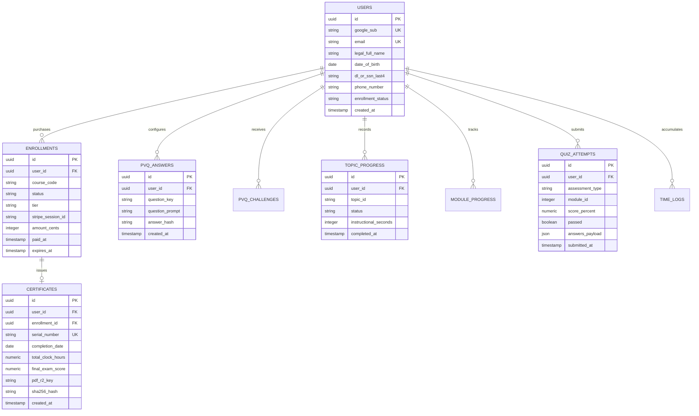

# Database Schema, Data Models & State Persistence Specification
## Complete Relational Blueprint for Cloudflare D1 (SQLite) & PostgreSQL
**Document Reference:** `cloud_architecture_spec/03_DATABASE_SCHEMA_AND_MODELS.md`  
**Target:** Implementation Engineers & Autonomous Database Migration Scripts  

---

## 1. Entity-Relationship Overview

The database must maintain an immutable, state-auditable record conforming to **Texas Administrative Code (16 TAC § 84.500)** while supporting 10,000+ active students.



---

## 2. Production SQL DDL (Cloudflare D1 / SQLite Compatible)

```sql
-- ============================================================================
-- 1. USERS TABLE
-- Stores Google Identity credentials and TDLR student profile information
-- ============================================================================
CREATE TABLE IF NOT EXISTS users (
    id TEXT PRIMARY KEY,                             -- UUID v4
    google_sub TEXT UNIQUE NOT NULL,                 -- Google OAuth unique identifier
    email TEXT UNIQUE NOT NULL,                      -- Canonical lowercase email
    full_name TEXT NOT NULL,                         -- Google profile display name
    legal_first_name TEXT,                           -- Official legal name for TDLR certificate
    legal_last_name TEXT,                            -- Official legal name for TDLR certificate
    date_of_birth TEXT,                              -- YYYY-MM-DD format (TDLR required)
    dl_or_ssn_last4 TEXT,                            -- Last 4 of DL or SSN (TDLR required)
    phone_number TEXT,                               -- Contact phone for student support
    profile_image TEXT,                              -- Google avatar URL
    role TEXT DEFAULT 'STUDENT',                     -- STUDENT, INSTRUCTOR, ADMIN
    enrollment_status TEXT DEFAULT 'UNPAID',         -- UNPAID, ACTIVE, COMPLETED, SUSPENDED
    created_at TEXT DEFAULT (datetime('now')),
    updated_at TEXT DEFAULT (datetime('now'))
);

CREATE INDEX IF NOT EXISTS idx_users_email ON users(email);
CREATE INDEX IF NOT EXISTS idx_users_google_sub ON users(google_sub);
CREATE INDEX IF NOT EXISTS idx_users_status ON users(enrollment_status);


-- ============================================================================
-- 2. ENROLLMENTS TABLE
-- Manages course payment verification and state-mandated 90-day time limits
-- ============================================================================
CREATE TABLE IF NOT EXISTS enrollments (
    id TEXT PRIMARY KEY,                             -- UUID v4
    user_id TEXT NOT NULL,                           -- Foreign key -> users.id
    course_code TEXT DEFAULT 'TX-ADE-1317',          -- Official TDLR course approval code
    status TEXT DEFAULT 'PENDING_PAYMENT',           -- PENDING_PAYMENT, ACTIVE, COMPLETED, EXPIRED
    tier TEXT DEFAULT 'STANDARD',                    -- STANDARD ($38.00) or EXPRESS ($47.99)
    stripe_session_id TEXT UNIQUE,                   -- Stripe Checkout Session ID
    stripe_payment_intent TEXT,                      -- Stripe Payment Intent reference
    amount_cents INTEGER NOT NULL,                   -- Price paid in cents (e.g. 3800 or 4799)
    paid_at TEXT,                                    -- Payment confirmation timestamp
    expires_at TEXT,                                 -- State law: Course expires 90 days from enrollment
    created_at TEXT DEFAULT (datetime('now')),
    FOREIGN KEY(user_id) REFERENCES users(id) ON DELETE CASCADE
);

CREATE INDEX IF NOT EXISTS idx_enrollments_user_id ON enrollments(user_id);
CREATE INDEX IF NOT EXISTS idx_enrollments_stripe_session ON enrollments(stripe_session_id);


-- ============================================================================
-- 3. PVQ_ANSWERS (Personal Validation Questions - 16 TAC § 84.500)
-- 5 identity validation questions chosen and answered during student onboarding
-- ============================================================================
CREATE TABLE IF NOT EXISTS pvq_answers (
    id TEXT PRIMARY KEY,                             -- UUID v4
    user_id TEXT NOT NULL,                           -- Foreign key -> users.id
    question_key TEXT NOT NULL,                      -- e.g., 'mother_maiden_name', 'first_pet'
    question_prompt TEXT NOT NULL,                   -- Friendly question text
    answer_hash TEXT NOT NULL,                       -- PBKDF2 / Argon2 / SHA-256 hashed answer (normalized lowercase)
    created_at TEXT DEFAULT (datetime('now')),
    FOREIGN KEY(user_id) REFERENCES users(id) ON DELETE CASCADE,
    UNIQUE(user_id, question_key)
);

CREATE INDEX IF NOT EXISTS idx_pvq_answers_user ON pvq_answers(user_id);


-- ============================================================================
-- 4. PVQ_CHALLENGES
-- Audit log of random identity intercepts during course progression
-- ============================================================================
CREATE TABLE IF NOT EXISTS pvq_challenges (
    id TEXT PRIMARY KEY,                             -- UUID v4
    user_id TEXT NOT NULL,                           -- Foreign key -> users.id
    question_key TEXT NOT NULL,                      -- Key of the question asked
    presented_at TEXT DEFAULT (datetime('now')),     -- When the question was rendered to student
    answered_at TEXT,                                -- When student clicked submit
    response_time_seconds INTEGER,                   -- Must be <= 90 seconds (TDLR statutory limit)
    is_correct INTEGER DEFAULT 0,                    -- 1 = Correct, 0 = Incorrect
    attempts_used INTEGER DEFAULT 1,                 -- Max 3 allowed before course freeze
    created_at TEXT DEFAULT (datetime('now')),
    FOREIGN KEY(user_id) REFERENCES users(id) ON DELETE CASCADE
);

CREATE INDEX IF NOT EXISTS idx_pvq_challenges_user ON pvq_challenges(user_id);


-- ============================================================================
-- 5. TOPIC_PROGRESS TABLE
-- Tracks the 75 individual curriculum topics (L01-T01 through L09-T01)
-- ============================================================================
CREATE TABLE IF NOT EXISTS topic_progress (
    id TEXT PRIMARY KEY,                             -- UUID v4
    user_id TEXT NOT NULL,                           -- Foreign key -> users.id
    topic_id TEXT NOT NULL,                          -- e.g. 'L01-T01', 'L04-T02'
    module_id INTEGER NOT NULL,                      -- 1 through 9
    status TEXT DEFAULT 'LOCKED',                    -- LOCKED, UNLOCKED, IN_PROGRESS, COMPLETED
    instructional_seconds INTEGER DEFAULT 0,         -- Active server-verified reading seconds
    formative_quiz_passed INTEGER DEFAULT 0,         -- 1 if in-lesson scenario check passed
    unlocked_at TEXT,
    completed_at TEXT,
    created_at TEXT DEFAULT (datetime('now')),
    updated_at TEXT DEFAULT (datetime('now')),
    FOREIGN KEY(user_id) REFERENCES users(id) ON DELETE CASCADE,
    UNIQUE(user_id, topic_id)
);

CREATE INDEX IF NOT EXISTS idx_topic_progress_user ON topic_progress(user_id);
CREATE INDEX IF NOT EXISTS idx_topic_progress_lookup ON topic_progress(user_id, topic_id);


-- ============================================================================
-- 6. MODULE_PROGRESS TABLE
-- Tracks unit boundaries and gating status for Modules 1 through 9
-- ============================================================================
CREATE TABLE IF NOT EXISTS module_progress (
    id TEXT PRIMARY KEY,                             -- UUID v4
    user_id TEXT NOT NULL,                           -- Foreign key -> users.id
    module_id INTEGER NOT NULL,                      -- 1 through 9
    status TEXT DEFAULT 'LOCKED',                    -- LOCKED, IN_PROGRESS, QUIZ_PENDING, COMPLETED
    quiz_passed INTEGER DEFAULT 0,                   -- 1 if passed >= 70%
    best_quiz_score REAL DEFAULT 0.0,                -- Percentage e.g. 85.0
    completed_at TEXT,
    created_at TEXT DEFAULT (datetime('now')),
    updated_at TEXT DEFAULT (datetime('now')),
    FOREIGN KEY(user_id) REFERENCES users(id) ON DELETE CASCADE,
    UNIQUE(user_id, module_id)
);

CREATE INDEX IF NOT EXISTS idx_module_progress_user ON module_progress(user_id);


-- ============================================================================
-- 7. QUIZ_ATTEMPTS TABLE
-- Full submission audit for module assessments and final exam
-- ============================================================================
CREATE TABLE IF NOT EXISTS quiz_attempts (
    id TEXT PRIMARY KEY,                             -- UUID v4
    user_id TEXT NOT NULL,                           -- Foreign key -> users.id
    assessment_type TEXT NOT NULL,                   -- 'MODULE_QUIZ' or 'FINAL_EXAM'
    module_id INTEGER,                               -- 1 to 9 (null for final exam if decoupled)
    total_questions INTEGER NOT NULL,                -- e.g., 10 or 30
    correct_count INTEGER NOT NULL,                  -- e.g., 8
    score_percentage REAL NOT NULL,                  -- e.g., 80.0
    passed INTEGER NOT NULL,                         -- 1 if score >= 70.0, else 0
    attempt_number INTEGER DEFAULT 1,                -- Sequential attempt counter
    student_responses_json TEXT,                     -- Sanitized record of submitted option keys
    started_at TEXT,
    submitted_at TEXT DEFAULT (datetime('now')),
    FOREIGN KEY(user_id) REFERENCES users(id) ON DELETE CASCADE
);

CREATE INDEX IF NOT EXISTS idx_quiz_attempts_user ON quiz_attempts(user_id);


-- ============================================================================
-- 8. INSTRUCTIONAL_TIME_LOGS TABLE
-- Server-side tamper-proof audit trail for 6-hour active time compliance
-- ============================================================================
CREATE TABLE IF NOT EXISTS instructional_time_logs (
    id TEXT PRIMARY KEY,                             -- UUID v4
    user_id TEXT NOT NULL,                           -- Foreign key -> users.id
    topic_id TEXT NOT NULL,                          -- Topic currently being read
    delta_seconds INTEGER NOT NULL,                  -- Validated interval (normally 30s)
    client_ip TEXT,                                  -- IP for fraud/proxy detection
    user_agent TEXT,
    timestamp TEXT DEFAULT (datetime('now')),
    FOREIGN KEY(user_id) REFERENCES users(id) ON DELETE CASCADE
);

CREATE INDEX IF NOT EXISTS idx_time_logs_user ON instructional_time_logs(user_id);
CREATE INDEX IF NOT EXISTS idx_time_logs_topic ON instructional_time_logs(user_id, topic_id);


-- ============================================================================
-- 9. CERTIFICATES TABLE
-- Official TDLR Form ADE-1317 Certificate serial assignment and issuance
-- ============================================================================
CREATE TABLE IF NOT EXISTS certificates (
    id TEXT PRIMARY KEY,                             -- UUID v4
    user_id TEXT NOT NULL,                           -- Foreign key -> users.id
    enrollment_id TEXT NOT NULL,                     -- Foreign key -> enrollments.id
    serial_number TEXT UNIQUE NOT NULL,              -- Official sequential TDLR serial (ADE-1317-XXXXX)
    tdlr_school_code TEXT DEFAULT 'C3284',           -- Licensed TDLR School Code
    student_legal_name TEXT NOT NULL,                -- Verified student legal name
    student_dob TEXT NOT NULL,                       -- Verified student DOB
    dl_or_ssn_last4 TEXT NOT NULL,                   -- Verified DL/SSN identifier
    completion_date TEXT NOT NULL,                   -- Date of passing final exam
    total_instructional_hours REAL NOT NULL,         -- Must be >= 6.00 hours (21,600 seconds)
    final_exam_score REAL NOT NULL,                  -- Must be >= 70.0%
    pdf_r2_key TEXT NOT NULL,                        -- Private R2 key for the signed PDF
    sha256_hash TEXT NOT NULL,                       -- Cryptographic hash of generated certificate
    verification_url TEXT NOT NULL,                  -- Public DPS verification link
    delivery_tier TEXT DEFAULT 'STANDARD',           -- STANDARD or EXPRESS
    issued_at TEXT DEFAULT (datetime('now')),
    FOREIGN KEY(user_id) REFERENCES users(id) ON DELETE CASCADE,
    FOREIGN KEY(enrollment_id) REFERENCES enrollments(id) ON DELETE CASCADE
);

CREATE INDEX IF NOT EXISTS idx_certificates_user ON certificates(user_id);
CREATE INDEX IF NOT EXISTS idx_certificates_serial ON certificates(serial_number);
```

---

## 3. High-Performance Aggregated Progress Query

When the Course Shell loads (`GET /api/v1/student/progress`), the edge worker executes a single optimized query returning the student's complete state in $<8\text{ms}$:

```sql
SELECT 
    u.id AS user_id,
    u.email,
    u.legal_first_name || ' ' || u.legal_last_name AS student_name,
    e.status AS enrollment_status,
    e.tier AS enrollment_tier,
    COUNT(CASE WHEN tp.status = 'COMPLETED' THEN 1 END) AS completed_topics_count,
    ROUND((CAST(COUNT(CASE WHEN tp.status = 'COMPLETED' THEN 1 END) AS REAL) / 75.0) * 100.0, 1) AS overall_progress_percent,
    COALESCE(SUM(tp.instructional_seconds), 0) AS total_active_seconds,
    (
        SELECT tp2.topic_id 
        FROM topic_progress tp2 
        WHERE tp2.user_id = u.id AND tp2.status IN ('UNLOCKED', 'IN_PROGRESS') 
        ORDER BY tp2.unlocked_at DESC 
        LIMIT 1
    ) AS current_active_topic_id,
    c.serial_number AS certificate_serial
FROM users u
LEFT JOIN enrollments e ON e.user_id = u.id AND e.status = 'ACTIVE'
LEFT JOIN topic_progress tp ON tp.user_id = u.id
LEFT JOIN certificates c ON c.user_id = u.id
WHERE u.id = ?
GROUP BY u.id;
```
