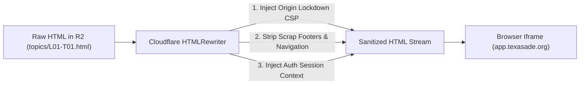

# Secure Content Delivery & Private Asset Pipeline Specification
## Zero-Public-Access Private Cloud Storage & Edge Streaming Engine
**Document Reference:** `cloud_architecture_spec/04_SECURE_CONTENT_DELIVERY_PIPELINE.md`  
**Target:** Cloud Infrastructure Engineers & Edge Worker Developers  

---

## 1. Private Cloud Storage Architecture (Cloudflare R2)

All 75 curriculum topics, 44 2.5D visual diorama images, and 76 assessment assets are stored in a **100% Private Cloudflare R2 Bucket**.

- **Bucket Name:** `tx-dmv-private-curriculum`
- **Public Bucket Access (r2.dev):** **STRICTLY DISABLED**.
- **Access Protocol:** Only reachable via Cloudflare Worker R2 Binding (`env.CURRICULUM_R2`).

### 1.1 Object Hierarchy within R2
```
tx-dmv-private-curriculum/
├── topics/
│   ├── L01-T01.html
│   ├── L01-T02.html
│   ├── ...
│   └── L09-T01.html                  [75 Total Verified Topic Files]
├── assets/
│   └── 2_5d/
│       ├── L01_T01_highway_corridor.jpg
│       ├── L01_T02_traffic_grid.jpg
│       ├── ...
│       └── L08_T08_wireless_devices.jpg   [44 Architectural Dioramas]
├── quizzes/
│   ├── mod_01_quiz.json
│   ├── mod_02_quiz.json
│   ├── ...
│   └── final_dps_exam.json           [Server-Evaluated Assessment Bank]
└── certificates/
    └── ADE1317-2026-00001.pdf        [Generated Tamper-Proof Certificates]
```

---

## 2. Sync & Deployment Pipeline (Local to R2)

To deploy clean curriculum files from local machine to Cloudflare R2 without exposing any sensitive or scrap files:

### Automated Upload Script (`scripts/sync_curriculum_to_r2.ts`)
```typescript
import { S3Client, PutObjectCommand } from '@aws-sdk/client-s3';
import fs from 'fs';
import path from 'path';

// R2 S3-Compatible Client Configuration
const r2 = new S3Client({
  region: 'auto',
  endpoint: `https://${process.env.CF_ACCOUNT_ID}.r2.cloudflarestorage.com`,
  credentials: {
    accessKeyId: process.env.R2_ACCESS_KEY_ID!,
    secretAccessKey: process.env.R2_SECRET_ACCESS_KEY!,
  },
});

const BUCKET = 'tx-dmv-private-curriculum';
const SOURCE_DIR = 'C:\\tx_dmv\\final_course_export';

async function uploadTopicFiles() {
  const files = fs.readdirSync(SOURCE_DIR);
  let count = 0;

  for (const file of files) {
    // Only upload official Lxx-Txx.html lessons (exclude scraps, bak, and Standalone variants)
    if (/^L\d{2}-T\d{2}\.html$/.test(file)) {
      const fileBuffer = fs.readFileSync(path.join(SOURCE_DIR, file));
      await r2.send(new PutObjectCommand({
        Bucket: BUCKET,
        Key: `topics/${file}`,
        Body: fileBuffer,
        ContentType: 'text/html; charset=utf-8',
        CacheControl: 'private, no-cache',
      }));
      count++;
      console.log(`[R2 SYNC] Uploaded topic: topics/${file}`);
    }
  }
  console.log(`[R2 SYNC COMPLETE] Successfully uploaded ${count} lessons to private R2 storage.`);
}

async function uploadDioramaAssets() {
  const assetsDir = path.join(SOURCE_DIR, 'assets', '2_5d');
  const files = fs.readdirSync(assetsDir);
  let count = 0;

  for (const file of files) {
    if (file.endsWith('.jpg') || file.endsWith('.png')) {
      const fileBuffer = fs.readFileSync(path.join(assetsDir, file));
      await r2.send(new PutObjectCommand({
        Bucket: BUCKET,
        Key: `assets/2_5d/${file}`,
        Body: fileBuffer,
        ContentType: 'image/jpeg',
        CacheControl: 'private, max-age=86400',
      }));
      count++;
    }
  }
  console.log(`[R2 SYNC COMPLETE] Uploaded ${count} 2.5D visual assets.`);
}

uploadTopicFiles().then(uploadDioramaAssets);
```

---

## 3. The Edge Streaming & Content Injection Engine

When an authorized student loads a lesson inside the course player iframe, the Edge Worker performs on-the-fly HTML header and script injection before streaming the response:



### Edge Worker Worker Implementation with `HTMLRewriter`:
```typescript
export async function streamSecureLessonHtml(
  r2ObjectBody: ReadableStream,
  studentContext: { userId: string; topicId: string; nonce: string },
  env: Env
): Promise<Response> {
  // Use Cloudflare HTMLRewriter for zero-latency streaming DOM transformation
  const transformedStream = new HTMLRewriter()
    // 1. Inject origin security & cross-frame communication context into <head>
    .on('head', {
      element(el) {
        el.append(
          `
          <meta http-equiv="Content-Security-Policy" content="frame-ancestors 'self' https://app.texasade.org https://learn.texasade.org;">
          <script>
            window.__TX_STUDENT_SESSION__ = {
              userId: "${studentContext.userId}",
              topicId: "${studentContext.topicId}",
              nonce: "${studentContext.nonce}",
              shellOrigin: "https://app.texasade.org"
            };

            // Secure postMessage communication to parent shell
            window.signalTopicCompletion = function() {
              window.parent.postMessage({
                type: 'TOPIC_COMPLETE',
                topicId: "${studentContext.topicId}",
                nonce: "${studentContext.nonce}"
              }, "https://app.texasade.org");
            };
          </script>
          `,
          { html: true }
        );
      }
    })
    // 2. Ensure internal lesson relative image paths resolve via the authenticated asset proxy
    .on('img', {
      element(el) {
        const src = el.getAttribute('src');
        if (src && src.startsWith('./assets/2_5d/')) {
          const fileName = src.replace('./assets/2_5d/', '');
          el.setAttribute('src', `/api/v1/assets/2_5d/${fileName}`);
        }
      }
    })
    .transform(new Response(r2ObjectBody));

  // Set HTTP response headers
  const headers = new Headers(transformedStream.headers);
  headers.set('Content-Type', 'text/html; charset=utf-8');
  headers.set('X-Frame-Options', 'SAMEORIGIN');
  headers.set('X-Content-Type-Options', 'nosniff');
  headers.set('Cache-Control', 'private, no-cache, no-store, must-revalidate');

  return new Response(transformedStream.body, { status: 200, headers });
}
```

---

## 4. Handling Direct URL Access Attempts

To ensure that direct navigation to paths like `www.ourdomain.com/lesson/t1l1` or `www.ourdomain.com/final_course_export/L01-T01.html` fails safely:

### 4.1 Cloudflare Edge Routing Rules
In `wrangler.toml` / Cloudflare Worker routes:
```toml
# Route patterns intercepted by the Auth Gateway Worker
routes = [
  { pattern = "app.texasade.org/api/*", zone_name = "texasade.org" },
  { pattern = "app.texasade.org/lesson/*", zone_name = "texasade.org" },
  { pattern = "app.texasade.org/final_course_export/*", zone_name = "texasade.org" },
  { pattern = "app.texasade.org/rebuilds/*", zone_name = "texasade.org" }
]
```

### 4.2 Gateway Intercept Matrix:
```typescript
export async function handleRouting(request: Request, env: Env): Promise<Response> {
  const url = new URL(request.url);
  const pathname = url.pathname;

  // RULE 1: Direct requests to internal directories return 404 (Obfuscation)
  if (pathname.startsWith('/final_course_export/') || pathname.startsWith('/rebuilds/')) {
    return new Response('404 Not Found', { status: 404 });
  }

  // RULE 2: Friendly direct links like /lesson/L01-T01 or /lesson/t1l1
  if (pathname.startsWith('/lesson/')) {
    const topicRaw = pathname.replace('/lesson/', '').toUpperCase();
    const topicId = normalizeTopicId(topicRaw); // 'T1L1' -> 'L01-T01'

    const session = await getSessionFromCookie(request, env);

    // If student is not logged in:
    if (!session) {
      // Redirect to login with return path
      return Response.redirect(`${url.origin}/login.html?returnTo=${encodeURIComponent(pathname)}`, 302);
    }

    // If student is logged in but hasn't paid:
    if (session.enrollment_status !== 'ACTIVE') {
      return Response.redirect(`${url.origin}/checkout.html`, 302);
    }

    // If student is active: check if this topic is unlocked
    const isUnlocked = await checkTopicUnlocked(session.id, topicId, env);
    if (!isUnlocked) {
      // Redirect to course shell with locked topic alert
      return Response.redirect(`${url.origin}/course-shell.html?lockedAlert=${topicId}`, 302);
    }

    // If unlocked: Redirect into Course Shell orchestrator with deep link query
    return Response.redirect(`${url.origin}/course-shell.html?topic=${topicId}`, 302);
  }

  // Fallthrough to regular API handler
  return handleApiRequest(request, env);
}
```
