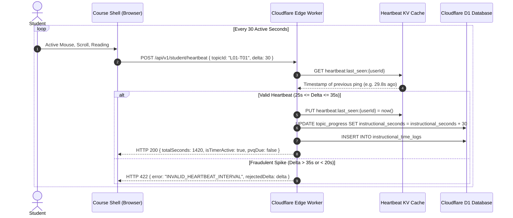
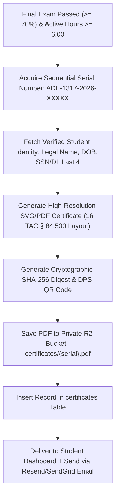

# TDLR 16 TAC § 84.500 Compliance & Certificate Engine Specification
## Statutory 6-Hour Timer, Identity Validation (PVQ), & Form ADE-1317 Issuance
**Document Reference:** `cloud_architecture_spec/05_COMPLIANCE_AND_CERTIFICATION_ENGINE.md`  
**Target:** Compliance Engineers, Backend Developers & LLM Implementers  

---

## 1. Regulatory Framework & Mandatory Controls

The Texas Department of Licensing and Regulation (TDLR) establishes strict legal mandates under **16 Texas Administrative Code § 84.500** and **Texas Transportation Code § 521.1601** for online Adult Driver Education (ADE-1317). 

Any software operating this course **MUST** implement and enforce the following 5 technical controls:

| Mandatory TDLR Control | Statutory Rule | Implementation in TX-ADE Platform |
|:---|:---|:---|
| **1. 6-Hour Instructional Time** | 16 TAC § 84.500(e) | Minimum **21,600 active instructional seconds** logged and cryptographically verified on server. Client cannot fabricate time. |
| **2. Inactivity Idle Detection** | 16 TAC § 84.500(f) | Any continuous period of **300 seconds (5 minutes)** without mouse/keyboard/scroll interaction auto-pauses instructional clock. |
| **3. Personal Validation Questions (PVQ)** | 16 TAC § 84.500(g) | 5 personal identity questions gathered at signup. Challenged at random intervals ($\le 60$ min). **90-second response countdown**. |
| **4. Mastery Assessment Thresholds** | 16 TAC § 84.500(h) | Module quizzes and final exam require **$\ge 70.0\%$ passing grade** before unlocking subsequent materials. |
| **5. Tamper-Proof ADE-1317 Certificate** | 16 TAC § 84.500(i) | Official certificate containing unique sequential state serial number, verified student identity, and completion timestamps. |

---

## 2. Server-Side 6-Hour Instructional Timer Engine

### 2.1 The Anti-Tampering Protocol
The student's browser must NEVER be trusted as the authoritative source of instructional time. The client only sends 30-second heartbeats; the server validates, records, and tallies time in the database.



### 2.2 Edge Worker Heartbeat Endpoint (`/api/v1/student/heartbeat`)
```typescript
export async function handleHeartbeat(request: Request, env: Env, user: AuthUser): Promise<Response> {
  const { topicId, deltaSeconds } = await request.json();

  // 1. Sanitize Delta (Allowed range: 25 to 35 seconds per ping)
  const clampedDelta = Math.min(Math.max(deltaSeconds, 0), 30);
  if (clampedDelta < 20) {
    return new Response(JSON.stringify({ error: 'DELTA_TOO_SMALL' }), { status: 400 });
  }

  // 2. Validate against last heartbeat timestamp stored in high-speed KV
  const kvKey = `hb:${user.id}`;
  const lastPingStr = await env.HEARTBEAT_KV.get(kvKey);
  const now = Date.now();

  if (lastPingStr) {
    const elapsedMs = now - parseInt(lastPingStr, 10);
    // If client is firing faster than 25 seconds, reject the packet (fraud prevention)
    if (elapsedMs < 25000) {
      return new Response(JSON.stringify({ error: 'RATE_LIMIT_EXCEEDED' }), { status: 429 });
    }
  }

  // 3. Update KV timestamp
  await env.HEARTBEAT_KV.put(kvKey, now.toString(), { expirationTtl: 300 });

  // 4. Batch increment instructional time in DB
  await env.DB.prepare(
    `UPDATE topic_progress 
     SET instructional_seconds = instructional_seconds + ?, updated_at = datetime('now')
     WHERE user_id = ? AND topic_id = ?`
  ).bind(clampedDelta, user.id, topicId).run();

  // 5. Query total accumulated instructional seconds across all topics
  const totalRow = await env.DB.prepare(
    `SELECT SUM(instructional_seconds) as total FROM topic_progress WHERE user_id = ?`
  ).bind(user.id).first();

  const totalSeconds = (totalRow?.total as number) || 0;

  // 6. Check if PVQ identity challenge is due (every 3600 seconds)
  const pvqDue = await checkPvqDue(user.id, totalSeconds, env);

  return new Response(JSON.stringify({
    success: true,
    totalInstructionalSeconds: totalSeconds,
    remainingSeconds: Math.max(21600 - totalSeconds, 0),
    pvqDue: pvqDue.isDue,
    pvqChallenge: pvqDue.challenge || null
  }), { status: 200, headers: { 'Content-Type': 'application/json' } });
}
```

---

## 3. Personal Validation Question (PVQ) Engine

### 3.1 Onboarding PVQ Setup
During checkout or account setup, the student must choose 5 questions and submit answers:
1. `pvq_mother_maiden`: Mother's maiden name
2. `pvq_first_pet`: Name of first pet
3. `pvq_childhood_street`: Street name where you grew up
4. `pvq_birth_city`: City in which you were born
5. `pvq_high_school_mascot`: High school mascot name

**Hashing Protocol:** Answers are trimmed, converted to lowercase, stripped of punctuation, and stored as salted SHA-256 / Argon2 hashes in `pvq_answers`.

### 3.2 Random Intercept & 90-Second Countdown
When `pvqDue: true` is triggered:
1. The Course Shell immediately disables the lesson iframe and opens the **Mandatory Identity Verification Modal**.
2. A strict 90-second client timer begins (`#pvq-countdown-timer`).
3. Student inputs answer and clicks "Verify Identity".
4. Server verifies hash:
   - **Correct:** Closes modal, issues 60-minute pass token in KV, resumes course.
   - **Incorrect:** Decrements allowed attempts (3 total).
   - **3 Failures or Timeout:** Flags account with `enrollment_status = 'SUSPENDED_PVQ_FAILURE'`. Student must contact instructor (`support@texasade.org`) to verify photo ID per 16 TAC § 84.500(g)(4).

---

## 4. Assessment Engine (Module Quizzes & Final Exam)

### 4.1 Module Quizzes (Modules 1–8)
- **Question Pool:** 10 to 15 questions per module.
- **Passing Standard:** $\ge 70.0\%$ (e.g. at least 7/10 or 11/15).
- **Execution:**
  - Evaluated on backend via `POST /api/v1/quizzes/submit`.
  - Stored in `quiz_attempts` table.
  - Passing score immediately unlocks the next module's first topic.
  - Failing score requires the student to review the module and retake.

### 4.2 Module 9 Final Exam (Official DPS Knowledge Test Simulator)
- **Question Pool:** 30 questions derived from Texas Driver Handbook.
- **Prerequisites to Unlock:**
  1. All 74 prior topics completed.
  2. All 8 prior module quizzes passed with $\ge 70\%$.
  3. Total accumulated instructional seconds $\ge 21,600$ (6.00 hours).
- **Exam Rules:**
  - 30 questions presented sequentially.
  - Passing threshold: $\ge 70\%$ (21 correct answers).
  - Maximum 3 attempts permitted. If failed 3 times, state law mandates course re-enrollment.

---

## 5. Official TDLR Form ADE-1317 Certificate Generator

Upon passing the Final Exam and meeting all 6 hours of instructional time, the backend initiates the **Automated Certificate Pipeline**:



### 5.1 Certificate Serial Assignment
Serial numbers are assigned atomically via SQLite/D1 transaction:
```sql
-- Allocate next available serial number
INSERT INTO certificates (
    id, user_id, enrollment_id, serial_number, tdlr_school_code,
    student_legal_name, student_dob, dl_or_ssn_last4, completion_date,
    total_instructional_hours, final_exam_score, pdf_r2_key, sha256_hash,
    verification_url, delivery_tier
) VALUES (
    ?, ?, ?, 
    'ADE1317-2026-' || LPAD((SELECT COUNT(*) + 1 FROM certificates), 5, '0'),
    'C3284', ?, ?, ?, date('now'), ?, ?, ?, ?, ?, ?
);
```

### 5.2 Verification Endpoint (`https://verify.texasade.org/cert/:serialNumber`)
A public, read-only endpoint allows Texas DPS Driver License offices and law enforcement to verify the authenticity of a student's certificate:
- Displays: Student Name, Completion Date, School Code (C3284), Passing Score, and State Status (`VALID & RECORDED`).
- Prevents fraud and counterfeit certificate presentations at the DPS counter.
